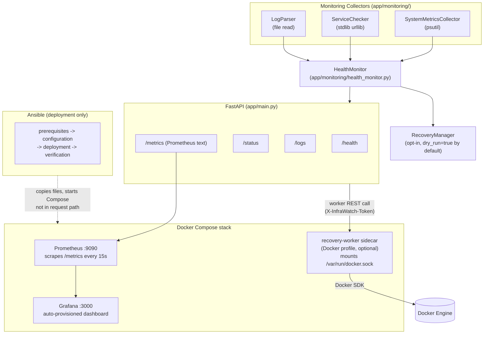
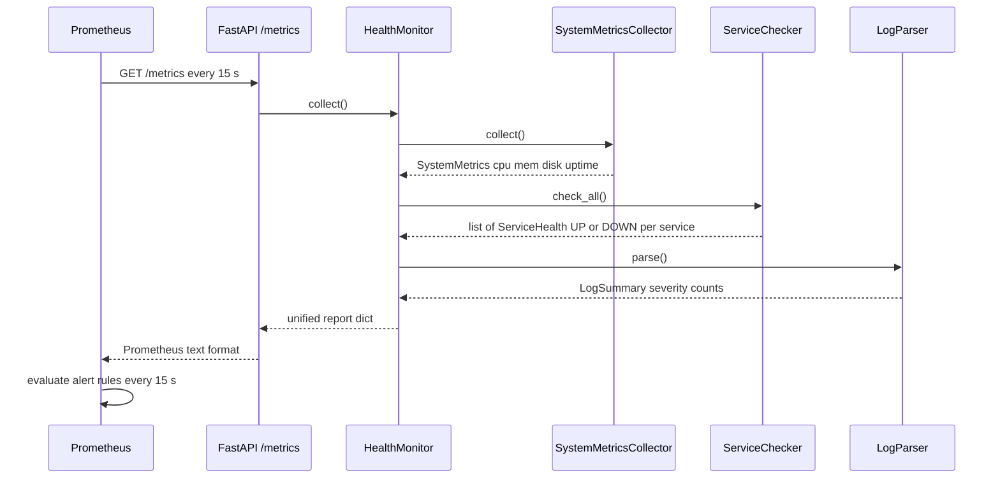
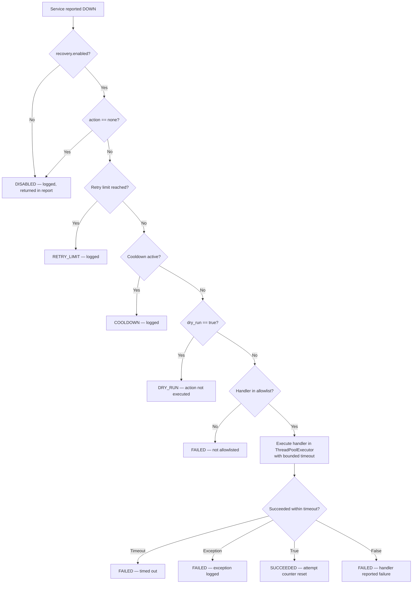
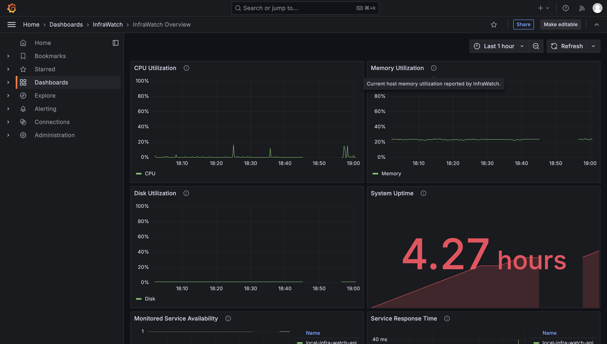
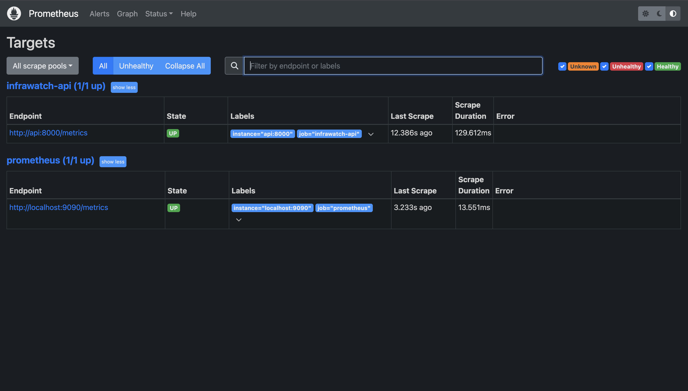

# InfraWatch — Infrastructure Health Monitoring & Automation

A modular **Python + FastAPI** infrastructure monitoring system with **Prometheus** metric collection, **Grafana** dashboards, opt-in **service recovery**, and **Ansible** deployment automation. Built as a DevOps/SRE portfolio project demonstrating production-aware engineering practices: safety-gated recovery, loopback-only bindings, credential redaction, non-root containers, and deterministic test coverage.

---

## Key Features

| Area | What is implemented |
|---|---|
| **System metrics** | CPU, memory, disk utilization, and uptime via `psutil` |
| **Service health** | Bounded HTTP/HTTPS checks with configurable timeouts and expected-status-code lists |
| **Log parsing** | Windowed severity-count extraction (up to 1,000 lines) without evaluating file contents |
| **Health aggregation** | Three-tier status: `HEALTHY` / `DEGRADED` / `UNHEALTHY`; required-service failures are always `UNHEALTHY` |
| **FastAPI REST API** | `/health`, `/status`, `/logs`, `/metrics`, and `/docs` |
| **Prometheus export** | Text-format metrics via `prometheus_client`; scraped every 15 s |
| **Grafana dashboards** | Auto-provisioned dashboard covering CPU, memory, disk, uptime, service availability, response time, log severity counts, and active alerts |
| **Alert rules** | Five Prometheus alerting rules plus three recording rules |
| **Safe recovery** | Opt-in, policy-driven recovery with dry-run default, retry limits, cooldown, allowlist, and timeout |
| **Docker recovery** | Optional `DockerContainerRestartHandler` via Docker SDK; Docker socket isolated to a separate `recovery-worker` sidecar |
| **Ansible automation** | Four roles: prerequisites, configuration, deployment, verification |
| **Test suite** | 76 pytest tests covering unit, integration, structural, and loopback HTTP sequences |

---

## Technology Stack

| Layer | Technology |
|---|---|
| Language | Python 3.12 |
| API framework | FastAPI 0.115 + Uvicorn 0.34 |
| Metrics export | prometheus-client 0.21 |
| System metrics | psutil 6.1 |
| Config parsing | PyYAML 6.0 |
| Containerization | Docker (python:3.12-slim base) + Docker Compose v2 |
| Monitoring stack | Prometheus v2.55.1 + Grafana v11.4.0 |
| Docker recovery | Docker SDK for Python 7.1 |
| Deployment automation | Ansible Core 2.15+ |
| Testing | pytest 8.3 + httpx 0.28 |

---

## Architecture



> **Note:** Ansible is used only for deployment. It is not part of the runtime request path.
> The `recovery-worker` sidecar is opt-in (Docker Compose profile `recovery`) and is not started by default.

---

## Monitoring Workflow



---

## Recovery Workflow



**Safety controls verified in source:**

- `dry_run=true` by default (`INFRAWATCH_RECOVERY_DRY_RUN=true` in `.env.example`)
- `INFRAWATCH_DOCKER_RECOVERY_ENABLED=false` by default
- Docker socket is **not** mounted in the API container; only the opt-in `recovery-worker` sidecar mounts it
- `action` selects an injected handler by name — no shell commands or arbitrary executables
- Container name must appear in `INFRAWATCH_RECOVERY_ALLOWED_CONTAINERS` before a restart is issued
- `RecoveryWorker` rejects tokens shorter than 16 characters or matching known placeholder prefixes

---

## Grafana Dashboard



### Dashboard panels

| Panel | Metric / Query |
|---|---|
| CPU Utilization | `infrawatch_cpu_utilization_percent` |
| Memory Utilization | `infrawatch_memory_utilization_percent` |
| Disk Utilization | `infrawatch_disk_utilization_percent` |
| System Uptime | `infrawatch_system_uptime_seconds` |
| Monitored Service Availability | `infrawatch_service_availability` |
| Service Response Time | `infrawatch_service_response_time_milliseconds` |
| Application Error & Critical Logs | `infrawatch_log_severity_count{severity=~"error\|critical"}` |
| Prometheus Scrape Health | `up{job="infrawatch-api"}` |
| Active Prometheus Alerts | `ALERTS{alertstate="firing"}` |

> **Dashboard note — uptime panel colour:** The *System Uptime* `stat` panel (id 4) has `unit: "s"` but its `thresholds.steps` array contains only a red base step for `null` values with no green step at any positive value. When Grafana renders a live uptime reading, it may display the panel in red because no threshold turns the colour green. This is a configuration gap in the dashboard JSON — it does not affect metric collection or alerting. A fix would add `{ "color": "green", "value": 0 }` to the uptime panel's `thresholds.steps` array. The application and dashboard have not been modified automatically.
>
> **Disk graph note:** The nearly flat disk-utilization graph in the screenshot is expected on a development host. `infrawatch_disk_utilization_percent` is a Gauge; disk usage changes slowly, so a flat line at the actual utilization percentage is correct behaviour.

---

## Prometheus Targets



---

## API Endpoints

| Method | Path | Description | HTTP codes |
|---|---|---|---|
| `GET` | `/health` | Process liveness — no monitoring checks run | `200` |
| `GET` | `/status` | Full coordinator report | `200` (HEALTHY/DEGRADED), `503` (UNHEALTHY) |
| `GET` | `/logs?limit=N` | Severity counts + recent ERROR/CRITICAL entries (limit 1–100) | `200`, `503` |
| `GET` | `/metrics` | Prometheus text-format metrics | `200` |
| `GET` | `/docs` | Auto-generated OpenAPI documentation | `200` |
| `GET` | `/` | Minimal service status response | `200` |

Example requests (local development):

```bash
curl http://127.0.0.1:8000/health
curl -i http://127.0.0.1:8000/status
curl 'http://127.0.0.1:8000/logs?limit=10'
curl http://127.0.0.1:8000/metrics
```

---

## Exported Metrics

| Metric | Type | Labels | Description |
|---|---|---|---|
| `infrawatch_cpu_utilization_percent` | Gauge | — | Host CPU utilization % |
| `infrawatch_memory_utilization_percent` | Gauge | — | Host memory utilization % |
| `infrawatch_disk_utilization_percent` | Gauge | — | Configured disk utilization % |
| `infrawatch_system_uptime_seconds` | Gauge | — | System uptime in seconds |
| `infrawatch_service_availability` | Gauge | `service`, `required` | 1 = UP, 0 = DOWN |
| `infrawatch_service_response_time_milliseconds` | Gauge | `service` | Latest HTTP response time |
| `infrawatch_log_severity_count` | Gauge | `severity` | Log entries per severity level |

---

## Alert Rules

Rules are evaluated every 15 s. Source: [`config/alerts/infra_rules.yml`](config/alerts/infra_rules.yml)

| Alert | Expression | `for` | Severity |
|---|---|---|---|
| `InfraWatchAPITargetUnavailable` | `up{job="infrawatch-api"} == 0` | 2 m | critical |
| `InfraWatchRequiredServiceDown` | `infrawatch_service_availability{required="true"} == 0` | 2 m | critical |
| `InfraWatchHighCPUUtilization` | `infrawatch_cpu_utilization_percent > 85` | 5 m | warning |
| `InfraWatchHighMemoryUtilization` | `infrawatch_memory_utilization_percent > 85` | 5 m | warning |
| `InfraWatchHighDiskUtilization` | `infrawatch_disk_utilization_percent > 85` | 5 m | warning |

Three recording rules (`infrawatch:cpu_utilization_percent`, `infrawatch:memory_utilization_percent`, `infrawatch:disk_utilization_percent`) are also defined for efficient re-use.

---

## Project Structure

```text
InfraWatch/
├── app/
│   ├── main.py                    # FastAPI application factory
│   ├── api/
│   │   ├── routes.py              # /health /status /logs /metrics endpoints
│   │   └── metrics.py             # PrometheusMetrics exporter
│   ├── core/
│   │   └── monitoring.py          # Build shared monitor from environment config
│   ├── monitoring/
│   │   ├── health_monitor.py      # Coordinator — aggregates all sources
│   │   ├── system_metrics.py      # psutil CPU/memory/disk/uptime collector
│   │   ├── service_checker.py     # HTTP/HTTPS service checks + YAML loader
│   │   ├── recovery.py            # RecoveryManager with dry-run and retry guards
│   │   └── docker_recovery.py     # DockerContainerRestartHandler + worker client
│   ├── log_parser/
│   │   └── log_parser.py          # Windowed log severity counter
│   └── recovery_worker.py         # Opt-in sidecar with Docker socket access
├── config/
│   ├── services.yaml              # Monitored service definitions
│   ├── prometheus/
│   │   └── prometheus.yml         # Scrape config (infrawatch-api job)
│   ├── alerts/
│   │   └── infra_rules.yml        # 5 alert rules + 3 recording rules
│   └── grafana/
│       ├── provisioning/          # Auto-provisioned datasource + dashboard
│       └── dashboards/
│           └── infrawatch-overview.json
├── ansible/
│   ├── ansible.cfg
│   ├── inventory/local.yml        # Loopback-only default inventory
│   ├── playbooks/
│   │   ├── site.yml               # Safe validation (no service start)
│   │   ├── deploy.yml             # Explicit deployment to isolated ports
│   │   └── verify.yml             # Liveness verification only
│   └── roles/
│       ├── prerequisites/         # Check source files and Docker availability
│       ├── configuration/         # Copy files to deployment directory
│       ├── deployment/            # Start services (only when requested)
│       └── verification/          # Bounded API/Prometheus/Grafana liveness checks
├── tests/                         # 76 pytest tests (unit, integration, structural)
├── scripts/
│   ├── run_monitoring_demo.py     # Monitoring engine demo (no API server needed)
│   └── failure_recovery_demo.py   # Loopback HTTP failure/recovery sequence
├── docs/
│   ├── images/
│   │   ├── grafana-overview.png
│   │   └── prometheus-targets.png
│   └── PRODUCTION_READINESS.md
├── Dockerfile                     # python:3.12-slim, non-root infrawatch user
├── docker-compose.yml             # api + prometheus + grafana; recovery-worker on profile
├── requirements.txt
└── .env.example                   # Safe development defaults
```

---

## Prerequisites

| Requirement | Notes |
|---|---|
| Python 3.9+ | 3.12 recommended (used in Docker image) |
| Docker Desktop | Required for Compose stack; includes Compose v2 |
| Git | — |
| Ansible Core 2.15+ | Only needed for Ansible playbooks; install separately from `.venv` |

---

## Local Setup

```bash
# Create virtual environment and install dependencies
python3 -m venv .venv
source .venv/bin/activate
python -m pip install --upgrade pip
python -m pip install -r requirements.txt

# Copy environment template
cp .env.example .env
# Edit .env: set GF_SECURITY_ADMIN_PASSWORD before running the stack
```

### Run locally (API only)

```bash
source .venv/bin/activate
uvicorn app.main:app --reload
```

The API is intended for **local development only**. It has no authentication and must not be exposed publicly.

### Run with Docker Compose (API + Prometheus + Grafana)

```bash
docker compose up --build -d

# Follow logs
docker compose logs -f api
docker compose logs -f grafana

# Check service health
docker compose ps

# Stop and remove containers
docker compose down
```

Services are published on loopback (`127.0.0.1`) only:

| Service | Local URL |
|---|---|
| InfraWatch API | `http://127.0.0.1:8000` |
| Prometheus | `http://127.0.0.1:9090` |
| Grafana | `http://127.0.0.1:3000` |

### Run demos

```bash
# Monitoring engine demo — no API server required
# (will report UNHEALTHY because the local service is not running)
source .venv/bin/activate
python -m scripts.run_monitoring_demo \
    --config config/services.yaml \
    --log tests/fixtures/sample_application.log

# Loopback HTTP failure/recovery sequence — no Docker required
python -m scripts.failure_recovery_demo
```

---

## Configuration & Environment Variables

All variables come from `.env`, sourced by Docker Compose. Copy `.env.example` and edit before use.

| Variable | Default | Description |
|---|---|---|
| `INFRAWATCH_SERVICES_CONFIG` | `config/services.yaml` | Path to service definitions YAML |
| `INFRAWATCH_LOG_PATH` | `logs/app.log` | Log file to parse (absence is reported, not fatal) |
| `INFRAWATCH_DISK_PATH` | `/` | Filesystem path for disk-usage metrics |
| `INFRAWATCH_CPU_INTERVAL` | `0.1` | `psutil.cpu_percent` blocking interval in seconds |
| `INFRAWATCH_BIND_ADDRESS` | `127.0.0.1` | Host-binding address for Compose port mappings |
| `INFRAWATCH_API_PORT` | `8000` | Published API port |
| `INFRAWATCH_PROMETHEUS_PORT` | `9090` | Published Prometheus port |
| `INFRAWATCH_GRAFANA_PORT` | `3000` | Published Grafana port |
| `GF_SECURITY_ADMIN_USER` | `admin` | Grafana admin username |
| `GF_SECURITY_ADMIN_PASSWORD` | `change-me-local-only` | **Change before any non-local use** |
| `INFRAWATCH_RECOVERY_DRY_RUN` | `true` | `true` = log recovery intent only; no action executed |
| `INFRAWATCH_DOCKER_RECOVERY_ENABLED` | `false` | Enable Docker SDK restart handler |
| `INFRAWATCH_RECOVERY_ALLOWED_CONTAINERS` | _(empty)_ | Comma-separated container names eligible for restart |
| `INFRAWATCH_RECOVERY_WORKER_URL` | `http://recovery-worker:8090` | Internal URL of the recovery-worker sidecar |
| `INFRAWATCH_RECOVERY_WORKER_TOKEN` | _(empty)_ | Shared token for worker authentication (min 16 chars) |

Service definitions live in [`config/services.yaml`](config/services.yaml). Add entries under `services` with `name`, `url`, and optional `required`, `timeout_seconds`, `expected_status_codes`, and `recovery` fields. Only `http://` and `https://` URLs are supported.

---

## Ansible Deployment

Ansible is used **for deployment only** — it is not part of the runtime monitoring path.

```bash
export ANSIBLE_CONFIG=ansible/ansible.cfg

# Syntax check (safe, no side effects)
ansible-playbook --syntax-check -i ansible/inventory/local.yml ansible/playbooks/site.yml

# Validate prerequisites without starting services
ansible-playbook -i ansible/inventory/local.yml ansible/playbooks/site.yml

# Dry run (check mode)
ansible-playbook --check -i ansible/inventory/local.yml ansible/playbooks/site.yml
```

**Deploy to an isolated local directory** (uses ports 18000/19090/13000 to avoid collisions with the main stack):

```bash
mkdir -p /tmp/infrawatch
cp .env.example /tmp/infrawatch/.env
# Edit /tmp/infrawatch/.env — replace all placeholder credentials

ANSIBLE_CONFIG=ansible/ansible.cfg ansible-playbook \
    -i ansible/inventory/local.yml ansible/playbooks/deploy.yml \
    -e infrawatch_deploy_dir=/tmp/infrawatch

# Verify the isolated deployment
ansible-playbook -i ansible/inventory/local.yml ansible/playbooks/verify.yml

# Clean up the isolated deployment
COMPOSE_PROJECT_NAME=infrawatch-ansible-local \
    docker compose -f /tmp/infrawatch/docker-compose.yml down
```

Files copied by the `configuration` role: `app/`, `config/`, `Dockerfile`, `docker-compose.yml`, `requirements.txt`, `.env.example`. The `.env`, `.venv`, `.git`, tests, and caches are **never** copied.

> Ansible is not installed in the development virtual environment. Syntax checks are documented but not locally verified. See [`docs/PRODUCTION_READINESS.md`](docs/PRODUCTION_READINESS.md) for remote-host inventory setup.

---

## Testing & Validation

```bash
# Full test suite
source .venv/bin/activate
python -m pytest -q

# Individual test files
python -m pytest tests/test_recovery.py -q          # Recovery policy and dry-run
python -m pytest tests/test_docker_recovery.py -q   # Docker restart handler (requires Docker)
python -m pytest tests/test_api.py -q               # FastAPI endpoint tests
python -m pytest tests/test_alert_rules.py -q       # Prometheus rule structural tests
python -m pytest tests/test_grafana_config.py -q    # Grafana provisioning structural tests
python -m pytest tests/test_ansible_config.py -q    # Ansible YAML structural tests
```

**Validation results (local run):**

```
76 passed in 9.67s
```

Test coverage includes:

| Scope | What is tested |
|---|---|
| Unit | System metrics collector, service checker, log parser, health monitor, recovery manager |
| Integration | FastAPI endpoints via `httpx`, coordinator report structure |
| Structural | YAML/JSON parsing of Prometheus config, alert rules, Grafana provisioning, Ansible playbooks |
| Behavioural | Alert pending/firing/resolved state transitions (synthetic), YAML rule shape validation |
| Loopback HTTP | Failure-and-recovery sequence: UP → 503 → DOWN → 200 → UP against an ephemeral loopback server |
| Docker recovery | Disposable container restart via allowlisted SDK handler (requires Docker) |

**Not verified by tests:** Docker image build, live Compose startup, Prometheus scrape ingestion, Grafana datasource loading, Ansible playbook execution.

---

## Security Considerations & Limitations

- **No authentication.** The API has no access controls. Do not expose it publicly.
- **Loopback-only bindings.** All Compose ports bind to `127.0.0.1` by default via `INFRAWATCH_BIND_ADDRESS`.
- **Non-root container.** The `infrawatch` system user runs the API process; no `root` or `sudo` inside the container.
- **No Docker socket in the API container.** Docker restart capability requires explicitly starting the opt-in `recovery-worker` sidecar (`docker compose --profile recovery up`).
- **Recovery is dry-run by default.** `INFRAWATCH_RECOVERY_DRY_RUN=true` until all three gates are set explicitly: `DRY_RUN=false`, `DOCKER_RECOVERY_ENABLED=true`, and a non-empty `ALLOWED_CONTAINERS` list.
- **No shell execution.** Recovery handlers are injected Python callables — not shell commands or executable paths.
- **Credential redaction.** `ServiceHealth.to_dict()` strips userinfo and query strings from service URLs before including them in API responses or logs.
- **Recovery worker token validation.** The sidecar rejects tokens shorter than 16 characters or matching known placeholder prefixes.
- **No secret management.** Credentials live in `.env` (excluded from version control). Production deployments require a secrets manager or environment injection.
- **No TLS.** All inter-service communication is plain HTTP on the private Compose network. External TLS termination is required for any production exposure.
- **No external alert delivery.** Alertmanager is not configured. Prometheus alert rules fire internally but no notifications are sent.

For full production hardening requirements, see [`docs/PRODUCTION_READINESS.md`](docs/PRODUCTION_READINESS.md).

---

## Future Improvements

- Alertmanager integration for email, Slack, or PagerDuty notifications
- Authentication layer (API keys or OAuth2) on the FastAPI endpoints
- TLS termination for inter-service and external traffic
- Multi-host Ansible inventory support with SSH key management
- Production secret management (HashiCorp Vault, AWS Secrets Manager)
- Prometheus remote-write or long-term storage backend
- Parallel service checks using `asyncio` or `ThreadPoolExecutor`
- Structured JSON logging with configurable log-level filtering
- Container image signing and supply-chain hardening
